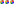

# Infographics

A Python package for generating basic infographic charts.

This is by no means a complete implementation.  In fact, it's rather limited.  How limited?  At this point it only generates Pie and Donut charts.  That's ... pretty limited -- especially considering the broad range of data visualization representations that most people expect in an infographic.

It all started with Donut charts, because there was a pressing need for them.  But it was obvious early on that more chart types _might_ be coming, and that establishing a foundation which could support multiple charts and graphics made sense.

So that's why there's all this infrastructure around one simple chart type.

In a nutshell:

* An infographic is a `Canvas` on which various charts (and other drawing objects) are placed.
* A Chart is a self-contained graphic, typically representing some data in an intuitive way.
* Charts are generated for specific datasets based on some _style_, in order to maintain consistency.
* A Donut chart is a circular Pie chart with a title in the middle.
* (A Pie chart is a Donut chart with no hole)

All of this happens in SVG.

The canvas and charts are expected to be generated programmatically. While it is possible to add pre-rendered elements to a canvas, it's probably easier to just create the desired graphic in an SVG editor, like [Inkscape](https://inkscape.org), in the first place.

## Installation

At this point, it's source-based only.

So, either run your scripts from a location containing the `infographics` package (e.g., from the same place as this README file), or download and install using `pip` locally:
```
$ pip install -e infographics
```
Omit the `-e` option if you don't need to edit the modules.

Run tests from the project directory (i.e., here):
```
$ python -m unittest
```


## Usage

All of the examples here may be found in the `examples` directory.

For clarity, the following examples always refer to the infographics through their modules:
```
from infographics import canvas, donuts
```
You may, of course, choose to import 

### Basics
Charts are based on a _style_, so that multiple charts can be created with a consistent look and feel:
```
style = donuts.DonutStyle()
```

A chart is _generated_ from the style, using a dataset containing, well, the data:
```
data = [ (25, "Fee", {}), (25, "Fi", {}), (25, "Fo", {}), (25, "Fum", {}) ]

chart = style.generate(data, title="Giant")
```

For a donut chart, the dataset is a list-like object containing one element for each wedge.  Each element is a list-like object consisting of a _weight_, a _label_ (which may be blank), and a presentation _options_ dict (which usually is blank).

The above chart has four wedges, each with a weight of 25.  The size of each wedge is relative to the total weight of all the data items.  In this case, the total weight is 100, and each wedge is then 25/100 of the whole donut/pie -- or 1/4.  If one wedge were, say, 50 instead, it would be twice as large as the others: 2/5 of the donut (50/125).

Each label is centered in its wedge, and adjusted by the presentation options.  Here, none of the labels have presentation options, so they are rendered horizontally and centered.

So how do you see the results?

A chart is just an `xml.etree.ElementTree` containing a single `svg` element.  You can use any library or tool that can render the svg element.  Setting up such a toolchain in python, however, is a fiddly business, and if you don't have one in place already, it's probably not worth the effort.

Fortunately, a chart may be saved directly to a file:
```
donuts.make_graphic(chart, "ex-basic.svg", width_cm=10)
```

The resulting file can be viewed with any reasonable SVG library or application: Chrome, Firefox, Inkscape, gThumb -- even emacs. Note that you need to provide the actual graphic size, in cm; here's what it looks like:


What about those "presentation options"?

Suppose the data had a skinny slice:
```
data.append( (5, "smell", {}) )
chart = style.generate(data, title="Giant")
donuts.make_graphic(chart, "ex-labels.svg", width_cm=10)
```

The label here is a little long, and extends beyond the thin wedge.  That's ugly; one presentation option is to _rotate_ the label:
```
data[4] = (5, "smell", {"rotate": True})
chart = style.generate(data, title="Giant")
donuts.make_graphic(chart, "ex-labels.svg", width_cm=10)
```

Better, but the label is a little crowded towards the center of the chart.  Other presentation options let you "nudge" the label a little bit in the x or y directions.  Note that the axes are relative to the text, not the chart.  So +x is to the right _along the text baseline_, and -x is to the left; +y is "down", perpendicular to the text baseline, and -y is "up".  Here, we'd like to slide the label a little closer to the outer edge:
```
data[4] = (5, "smell", {"rotate": True, "dx":-0.5})
chart = style.generate(data, title="Giant")
donuts.make_graphic(chart, "ex-labels.svg", width_cm=10)
```

A nudge is relative to the font size.  So, a nudge of "1" is roughly 1 em.
And the whole progression looks something like this:



Remembering how to format the data items with their presentation options can be ... tedious.  There is a convenience function for that:
```
item1 = donuts.mk_wedge(25, "Fred")
item2 = donuts.mk_wedge(5, "Barney", rotate=True, dx=-0.5)
# or:
data = [ mk_wedge(25, "George"), mk_wedge(5, "Jane", rotate=True) ]
```


### Customization
lots of wedges; colors repeat

tailoring the chart style.  sizes, colors, start angle

pie charts

### Composition
putting multiple charts together: the canvas

### Annotations
chart itself is svg element; canvas.svg member; can add elements manually (e.g., automation)

for one-off, better to use an editor

editing canvas and chart in Inkscape; adding charts to non-canvas drawings


## Considerations

Different SVG rendering libraries work differently.

For example, some do not support the "dominant-baseline" attribute for text elements.  Which means that a label which is _supposed_ to be centered vertically on a reference line is instead aligned on its baseline (making it appear slightly "higher" than it should).

## Reference

### Canvas
The "canvas" is the sheet/page/container into which charts (etc.) are placed.

construction

add_graphic

write. with or without DOCTYPE.

### Charts

TBS.

generic considerations for all chart types (even though there's currently only one).

style vs. object

strategy for tailoring (sizes relative to "full").

labels and how to adjust them (dx, dy "nudges")

#### Pie and Donut Charts

TBS.

a pie chart is a donut chart with no hole.

constructing a style

generating a chart.  datasets.  labels and text.

convenience function to fit and write a canvas to a chart


